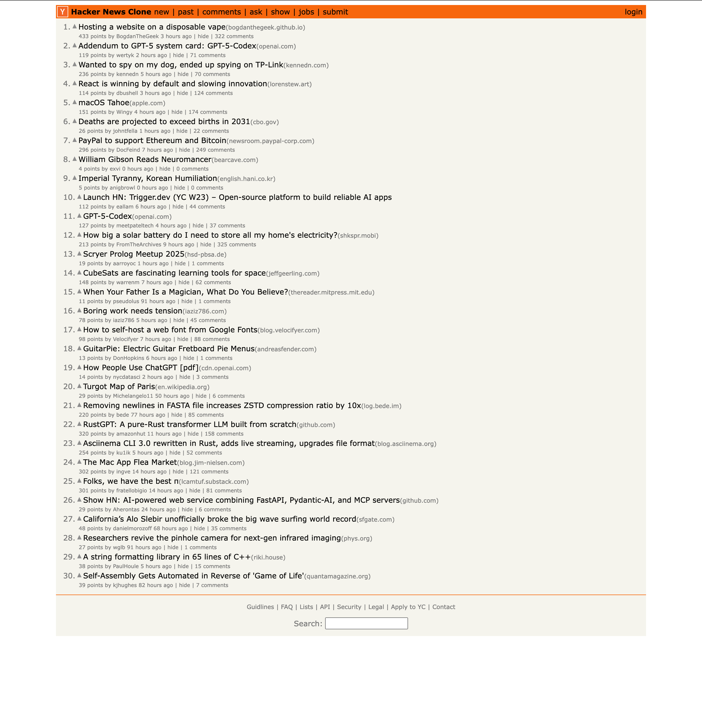

# Hacker News Clone

This project is a clone of [Hacker News](https://news.ycombinator.com/), built with TypeScript and React.

### Purpose of this project

Continuous development, training, and review of the following skills:

- [TypeScript](https://www.typescriptlang.org/)
- [React](https://react.dev/)
  - Hooks
  - RESTful API
- [Tailwind CSS](https://tailwindcss.com/)
- [Storybook](https://storybook.js.org/)

### Some Caveat

- This app is not a 100% clone of Hacker News
- The app's homepage is the only page that is functional
- This project is simply to see how fast I can build a page with little to no testing, and to review the tech stacks that I've worked on in the past

